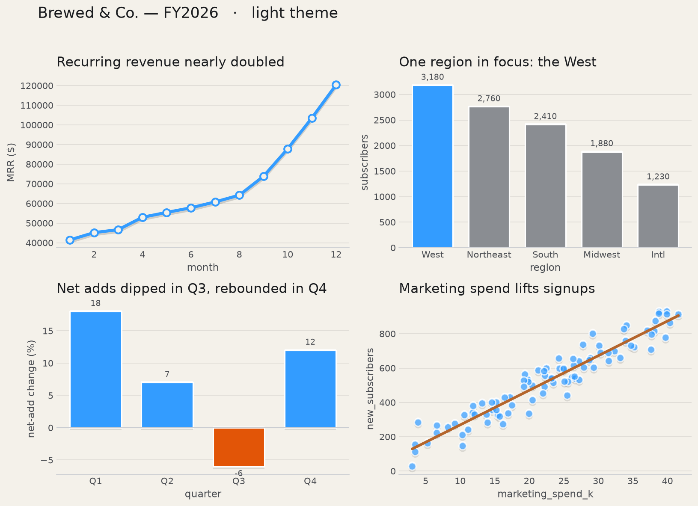
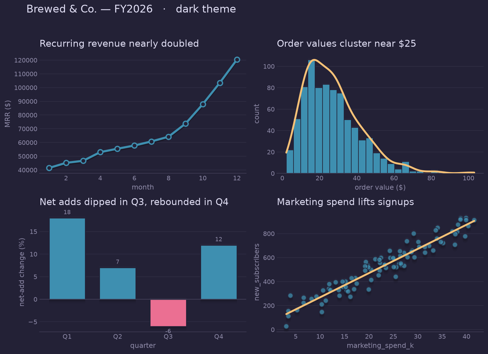

# data_vizual

A small, pip-installable Python library of **bare-bones pandas helpers and
styled matplotlib plots** — the foundation for building your own personal data
visualization aesthetic.

This is the MVP of the `data_viz` project: it reduces the boilerplate of going
from a raw dataset to useful summaries and charts. Every function does exactly
one thing, has a conventional name, and returns a standard pandas or matplotlib
object, so the library stays easy to read, test, and debug.

## Gallery

A playful, softly dimensional look — a blue-led palette (burnt orange for
emphasis), soft mark shadows, quiet unframed axes, and faint gridlines — in both
light and dark themes. Below: a small dashboard for a fictional coffee company
(`python examples/gallery.py`).

| Light | Dark |
| --- | --- |
|  |  |

## Installation

From a local clone (editable install for development):

```bash
pip install -e .
```

Once published, it will install the usual way:

```bash
pip install data_vizual
```

## Usage

```python
import data_vizual as dv

dv.set_theme("light")        # pick the theme once ("light" or "dark")

df = dv.load_csv("data/sales.csv")
dv.summary_statistics(df)    # count / mean / std / min / quartiles / max
dv.missing_value_counts(df)  # missing values per column (highest first)

# Each plot returns a matplotlib Axes you can keep customizing.
dv.line_plot(df, x="month", y="revenue", title="Revenue nearly doubled")
dv.hist_plot(df, column="order_value")                      # bars + density line
dv.bar_plot(df, x="quarter", y="growth", by_sign=True)      # blue / negative
dv.bar_plot(df, x="region", y="sales", highlight="West")    # one bar in focus
dv.scatter_plot(df, x="ad_spend", y="signups", trendline=True)
```

## Design system

The look is **playful, editorial, and softly dimensional**: blue carries most
of the visual weight, **burnt orange is reserved for emphasis**, marks have a
soft theme-aware drop-shadow (depth on the data, not cards around it), chart
backgrounds are transparent and unframed, gridlines are thin and low-opacity,
and axes stay quiet. Two themes ship: **`light`** (blue-led) and **`dark`**
(the [Rosé Pine Moon](https://rosepinetheme.com) palette — pine, gold, love,
foam, iris on a navy base).

**Color tokens** (read any with `dv.theme_tokens()`):

| Token | Role |
| --- | --- |
| `page` | figure background |
| `primary` / `secondary` / `muted` | text ink |
| `accent` | primary blue — carries most of the weight |
| `emphasis` | burnt orange — emphasis / trend lines only |
| `negative` | negative / destructive orange-red |
| `series` | categorical palette (blue, burnt orange, green, teal, plum) |
| `grid` / `baseline` | quiet gridline & axis colors |
| `shadow_*` | the soft neomorphic drop-shadow pair |

| light blue | burnt orange | green | teal | negative |
| --- | --- | --- | --- | --- |
| `#339CFF` | `#B4652C` | `#5DC977` | `#3AB9B1` | `#E25507` |

Color is spent deliberately, always paired with position, a label, or a line
so nothing relies on color alone: `bar_plot(..., by_sign=True)` colors bars
blue (positive) / orange-red (negative); `bar_plot(..., highlight="West")`
accents one bar and mutes the rest; `scatter_plot(..., trendline=True)` adds a
burnt-orange regression line. Insight-led titles (`title=`) act as direct
labels.

> Scope: this is an MVP (core module under 200 lines) — three chart types on a
> shared theme. Static matplotlib output, so web concepts like
> `prefers-reduced-motion`, DOM tooltips, and keyboard focus don't apply.

## API

| Function | Purpose |
| --- | --- |
| `set_theme(mode)` / `theme_tokens()` / `available_themes()` | Apply and read the theme tokens. |
| `load_csv(path, **kwargs)` | Read a CSV into a DataFrame (clear error if missing). |
| `summary_statistics(df)` | Descriptive stats for numeric columns. |
| `missing_value_counts(df)` | Missing values per column, sorted descending. |
| `line_plot(df, x, y, ...)` | Line + open markers with a soft shadow. |
| `hist_plot(df, column, bins=20)` | Histogram with a smooth density (distribution) line overlaid. |
| `bar_plot(df, x, y, ...)` | Bars with soft depth + value labels; `by_sign`, `highlight`. |
| `scatter_plot(df, x, y, trendline=False)` | Translucent points; optional burnt-orange trend line. |

Every plot accepts an optional `ax=` and returns the `Axes`, so you can compose
charts onto your own figures and keep styling in your control.

## Project layout

```
data_viz/
├── src/
│   └── data_vizual/
│       ├── __init__.py   # public API
│       └── core.py       # all functions (load / summarize / plot)
├── tests/
│   └── test_core.py
├── README.md
├── pyproject.toml
└── LICENSE
```

## Development

```bash
pip install -e ".[dev]"   # install with test dependencies
pytest -q                 # run the tests
```

## Conventions

- Use **pandas**, not polars.
- Plots use **matplotlib** only.
- Raw data lives in `data/`; CSVs are never committed.

## License

Licensed under the terms of the [MIT License](LICENSE).
