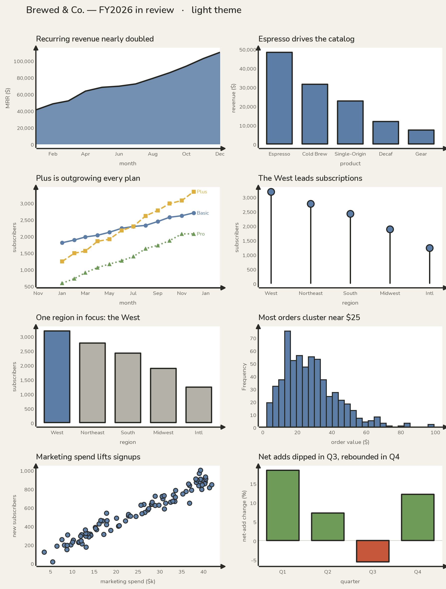
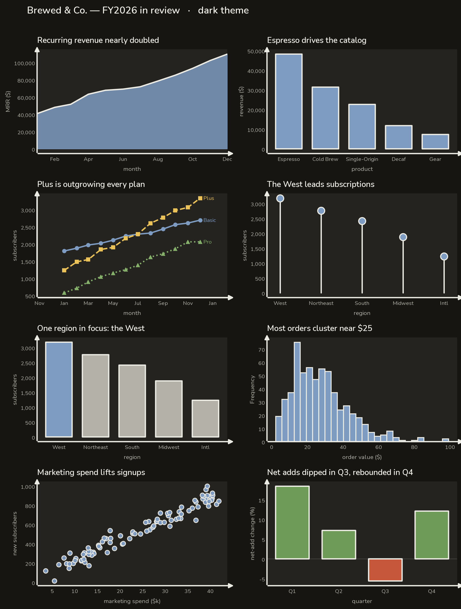
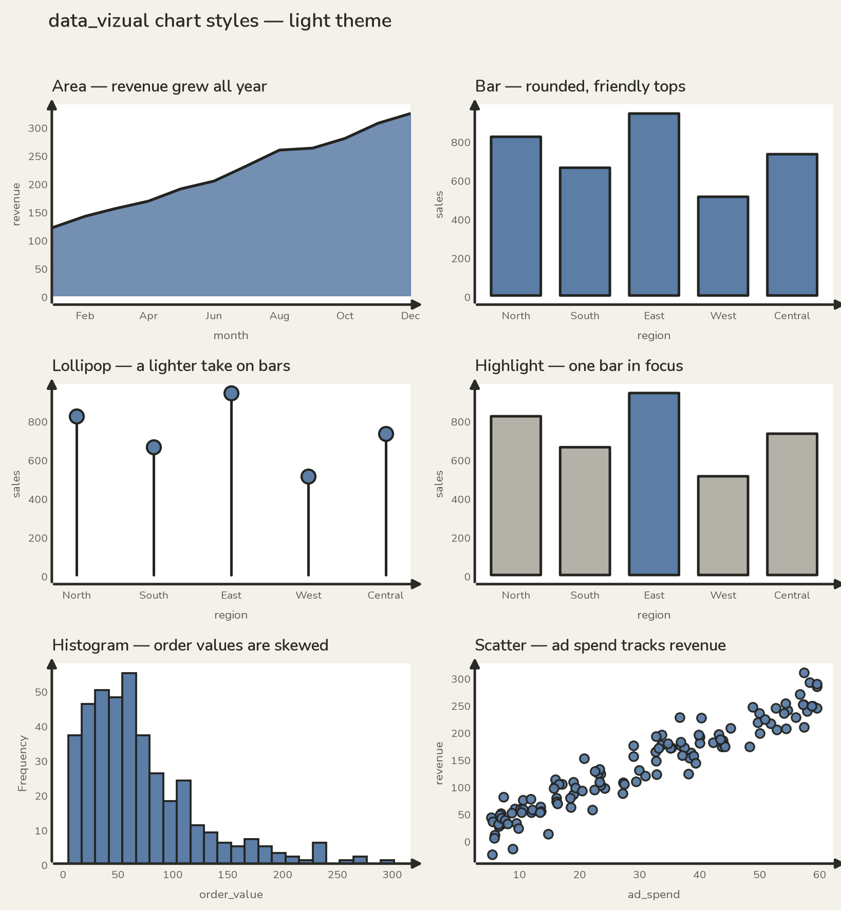
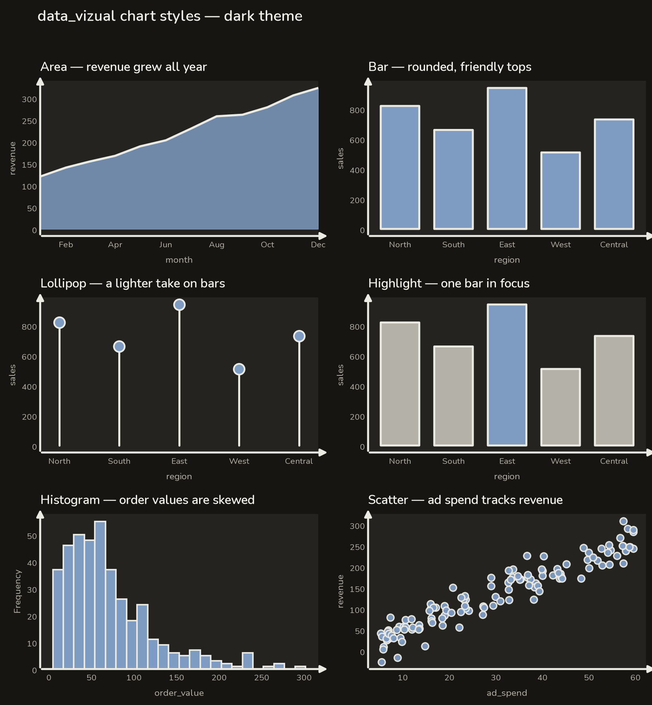
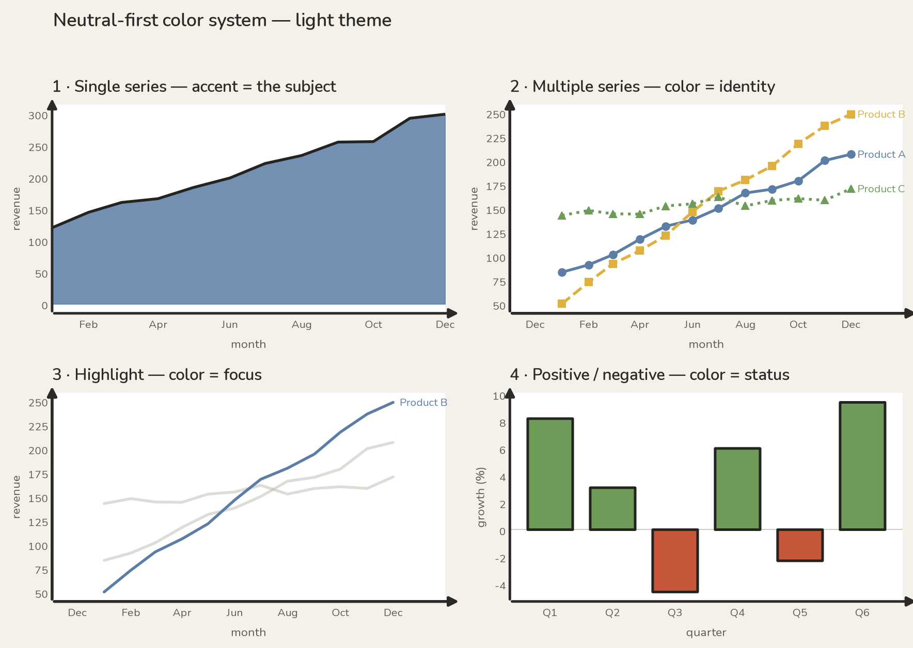
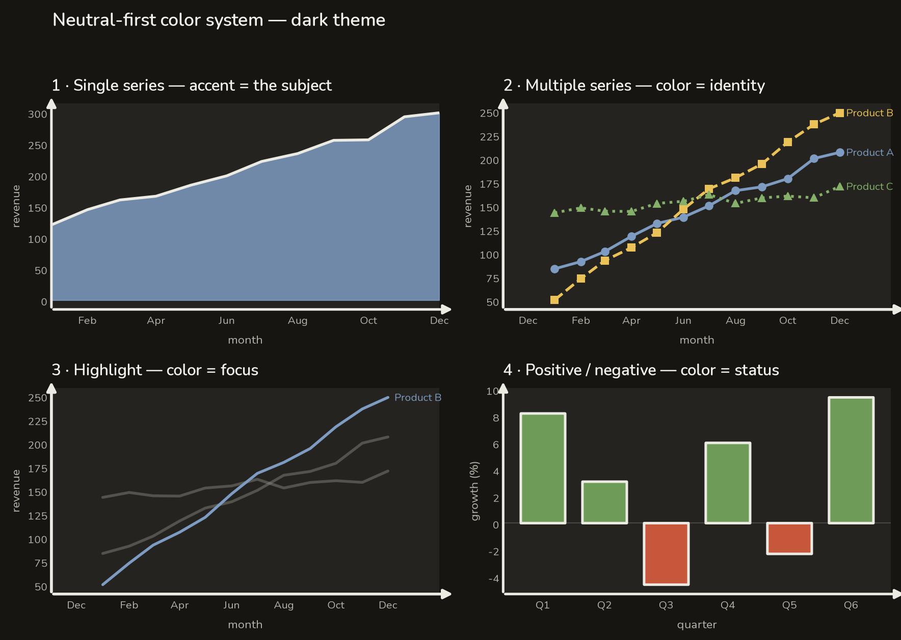

# data_vizual

A small, pip-installable Python library of **bare-bones pandas helpers and
styled matplotlib plots** — the foundation for building your own personal data
visualization aesthetic.

This is the MVP of the `data_viz` project: it reduces the boilerplate of going
from a raw dataset to useful summaries and charts. Every function does exactly
one thing, has a conventional name, and returns a standard pandas or matplotlib
object, so the library stays easy to read, test, and debug.

## Gallery

A hand-drawn, editorial look — muted earthy palette, bold outlines, rounded
shapes, arrow-tipped axes — in both light and dark themes.

### A worked example

Every chart type on one realistic (fictional) dataset — the 2026 year of
*Brewed & Co.*, a coffee-subscription company (`python examples/showcase.py`):

| Light | Dark |
| --- | --- |
|  |  |

### The chart styles

The six styles on their own (`python examples/gallery.py`):

| Light | Dark |
| --- | --- |
|  |  |

Color used deliberately — single series, multiple series, highlight, and
positive/negative (`python examples/color_system.py`):

| Light | Dark |
| --- | --- |
|  |  |

## Installation

From a local clone (editable install for development):

```bash
pip install -e .
```

Once published, it will install the usual way:

```bash
pip install data_vizual
```

## Usage

```python
import data_vizual as dv

dv.set_theme("light")        # pick the visual language once ("light" or "dark")

# 1. Load
df = dv.load_csv("data/sales.csv")

# 2. Summarize
dv.column_types(df)          # dtype of each column
dv.missing_value_counts(df)  # missing values per column (highest first)
dv.summary_statistics(df)    # count / mean / std / min / quartiles / max

# 3. Plot  (each returns a matplotlib Axes you can keep customizing)
ax = dv.histogram(df, "revenue", bins=20, title="Revenue is right-skewed")

dv.line_plot(df, x="day", y="revenue", title="Revenue climbed all year")
dv.area_plot(df, x="day", y="revenue")   # gradient fill adds depth
dv.bar_plot(df, x="region", y="revenue")
dv.scatter_plot(df, x="ad_spend", y="revenue")
```

See it for yourself — the examples gallery renders every chart type in both
themes:

```bash
python examples/gallery.py          # writes gallery-light.png and gallery-dark.png
python examples/gallery.py --show   # or open interactive windows
```

## Design system

The look is **hand-drawn / editorial**: a warm paper (or charcoal) surface, a
**muted earthy palette**, **bold near-black outlines** on every mark, chunky
rounded shapes, and **arrow-tipped axes** instead of a gridlines-and-box frame.
Playful and warm — closer to a printed infographic than a dashboard. Two themes
ship: **`light`** and **`dark`**.

**Color tokens** (read any with `dv.theme_tokens()`):

| Token | Role |
| --- | --- |
| `surface` / `page` | chart & figure backgrounds (warm paper / charcoal) |
| `primary` / `secondary` / `muted` | text ink |
| `outline` | bold near-black (or off-white) mark outlines |
| `baseline` | the arrow-axes ink |
| `accent` | default single-series color — **muted blue `#5B7DA6`** |
| `series` | the 6-color earthy palette |
| `good` / `warning` / `bad` / `neutral` | reserved semantic colors |
| `context` / `reference` | de-emphasized comparison series & baselines |

**Series palette** — a muted, earthy set (no bright corporate primaries):

| 1 steel blue | 2 mustard | 3 sage | 4 terracotta | 5 warm gray | 6 plum |
| --- | --- | --- | --- | --- | --- |
| `#5B7DA6` | `#E0B03E` | `#6E9B57` | `#C6573A` | `#8E8B84` | `#7E5A8C` |

Colors are still **spent deliberately**, always paired with a marker, line
style, or direct label so nothing relies on color alone:

- **Single series** → the accent (the subject is the emphasis).
- **Multiple series** → the palette in order + markers/line styles.
  `line_plot(..., marker="o", linestyle="--")`.
- **Highlight a comparison** → the focus series in `accent`, the rest in
  `context` gray at low `alpha`; or `bar_plot(..., highlight="East")`.
- **Positive / negative** → `bar_plot(..., by_sign=True)` colors bars
  sage/terracotta by sign and adds a zero reference line.
- **Semantic** → `good`/`warning`/`bad`/`neutral` are reserved for meaning.

Run `python examples/color_system.py` to render all of these in both themes.

`area_plot` fills flat under a bold outline by default; pass `gradient=True`
for a theme-aware depth gradient instead.

**Type & shape.** The library bundles **Nunito** (a friendly, rounded sans,
SIL OFL) and registers it automatically, so the approachable look renders
anywhere without a system font install. Bars get a soft **rounded data-end**
(square on the baseline) by default — pass `rounded=False` for crisp corners.
`lollipop_plot` offers a lighter alternative to a wall of bars.

**What the defaults do**

- Left-aligned title as the single takeaway (`title=` on any plot).
- Top/right spines removed; remaining axes and a horizontal-only grid are
  hairlines sitting *behind* the data.
- Clean system-sans typography with a clear size hierarchy.
- Thousands-grouped numbers with no noisy trailing `.0`.
- Frameless legends; a `direct_label(ax, x, y, text)` helper for labeling the
  point that tells the story instead of a legend.
- A tidy empty state ("No data to display") instead of a blank chart, and clear
  errors that name a missing column and list what's available.

**Customization.** Attractive defaults are easy; overrides are always available:

```python
dv.set_theme("dark")                              # switch themes
dv.bar_plot(df, "region", "sales", color="#eb6834")  # override a single color
ax = dv.line_plot(df, "day", "revenue")
ax.set_ylim(0, 500)                               # it's a normal Axes — tweak freely
```

Every plot also accepts an existing `ax=`, so you can compose charts onto your
own figures (e.g. small multiples, like the gallery).

> Note: charts are static matplotlib figures, so there is no animation by
> design (which keeps motion out of the way). Web concepts like
> `prefers-reduced-motion` and loading states don't apply to static output.

## API

| Function | Purpose |
| --- | --- |
| `load_csv(path, **kwargs)` | Read a CSV into a DataFrame (clear error if missing). |
| `column_types(df)` | Dtype of each column. |
| `missing_value_counts(df)` | Missing values per column, sorted descending. |
| `summary_statistics(df)` | Descriptive stats for numeric columns. |
| `line_plot(df, x, y, ...)` | Line chart of `y` over `x` (`marker`, `linestyle`, `alpha` for multi-series). |
| `area_plot(df, x, y, gradient=True)` | Filled area with a subtle depth gradient (`gradient=False` for a flat wash). |
| `lollipop_plot(df, x, y, highlight=None)` | A lighter, friendlier take on the bar chart (stem + dot). |
| `bar_plot(df, x, y, ...)` | Bar chart with rounded tops; `by_sign` (green/red), `highlight`, `rounded=False`. |
| `histogram(df, column, bins=10, ax=None)` | Distribution of one numeric column. |
| `scatter_plot(df, x, y, ax=None)` | Relationship between two numeric columns. |

Every plot function accepts an optional `ax`, so you can compose charts onto
your own figures, and returns the `Axes` rather than showing it — keeping you
in control of styling and making plots easy to test.

## Project layout

```
data_viz/
├── src/
│   └── data_vizual/
│       ├── __init__.py   # public API
│       └── core.py       # all functions (load / summarize / plot)
├── tests/
│   └── test_core.py
├── README.md
├── pyproject.toml
└── LICENSE
```

## Development

```bash
pip install -e ".[dev]"   # install with test dependencies
pytest -q                 # run the tests
```

## Conventions

- Use **pandas**, not polars.
- Plots use **matplotlib** only.
- Raw data lives in `data/`; CSVs are never committed.

## License

Licensed under the terms of the [MIT License](LICENSE).
