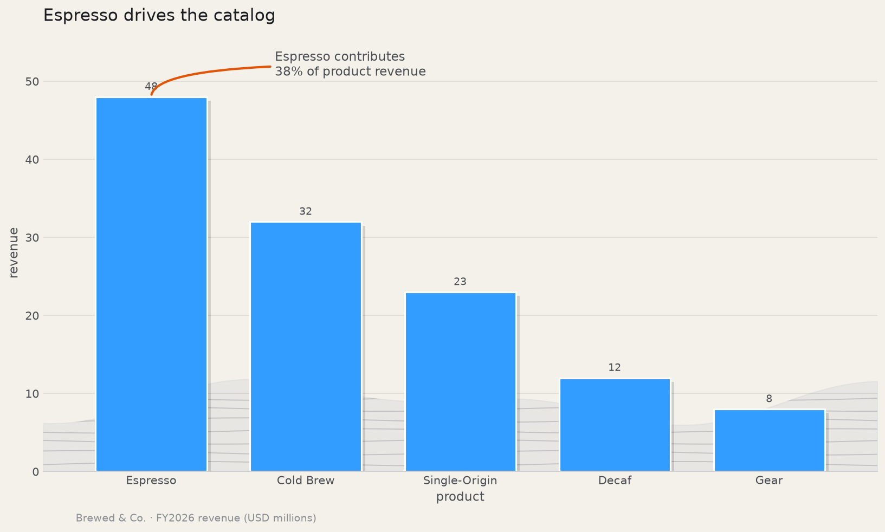
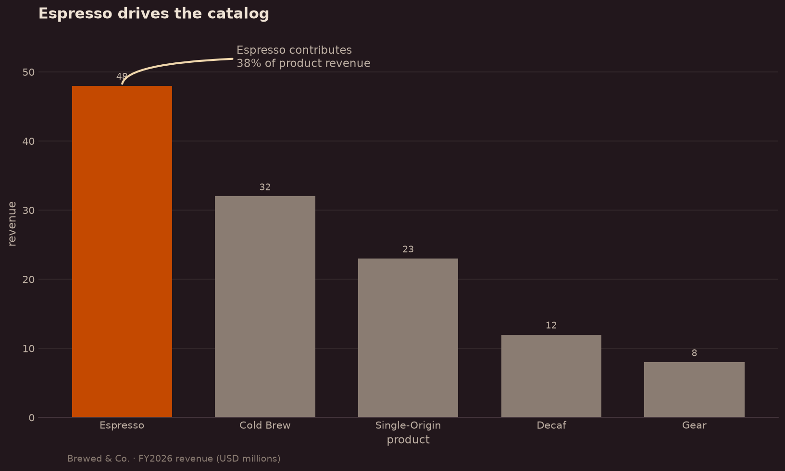
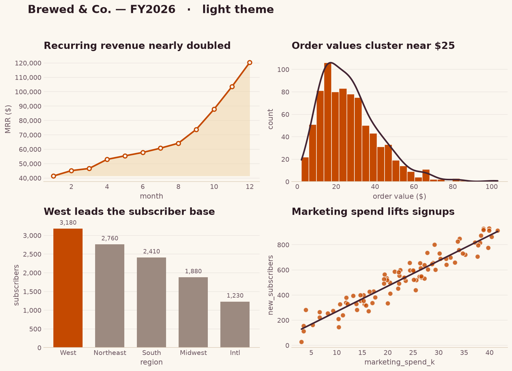
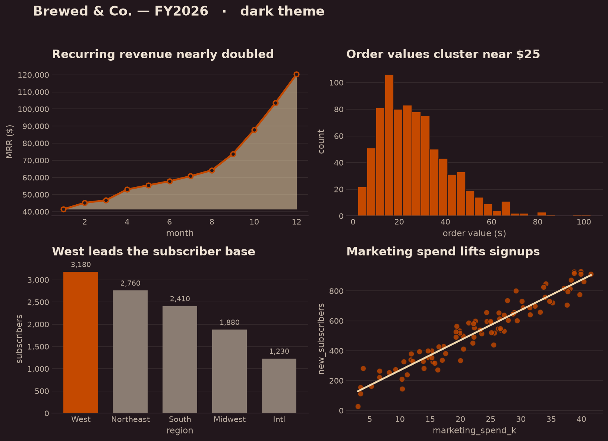

# data_vizual

A small, pip-installable Python library of **bare-bones pandas helpers and
styled matplotlib plots** — the foundation for building your own personal data
visualization aesthetic.

This is the MVP of the `data_viz` project: it reduces the boilerplate of going
from a raw dataset to useful summaries and charts. Every function does exactly
one thing, has a conventional name, and returns a standard pandas or matplotlib
object, so the library stays easy to read, test, and debug.

## Gallery

A clean, minimal look — a burnt-orange-led palette with cream and plum in
support, quiet unframed axes, faint gridlines, and flat single-colour marks
(no textures, no shadows) — in both light and dark themes. Run
`python examples/gallery.py`.

**Single-focus bars** (`bar_plot(..., highlight="Espresso")`) — one accent bar
carries the headline while the rest recede to grey:

| Light | Dark |
| --- | --- |
|  |  |

**The full dashboard** for a fictional coffee company:

| Light | Dark |
| --- | --- |
|  |  |

## Installation

From a local clone (editable install for development):

```bash
pip install -e .
```

Once published, it will install the usual way:

```bash
pip install data_vizual
```

## Usage

```python
import data_vizual as dv

dv.set_theme("light")        # pick the theme once ("light" or "dark")

df = dv.load_csv("data/sales.csv")
dv.summary_statistics(df)    # count / mean / std / min / quartiles / max
dv.missing_value_counts(df)  # missing values per column (highest first)

# Each plot returns a matplotlib Axes you can keep customizing.
dv.line_plot(df, x="month", y="revenue", fill=True, title="Revenue doubled")
dv.hist_plot(df, column="order_value")                      # solid orange bars
dv.bar_plot(df, x="quarter", y="growth", by_sign=True)      # orange up / plum down
dv.bar_plot(df, x="region", y="sales", highlight="West")    # one bar in focus
dv.scatter_plot(df, x="ad_spend", y="signups", trendline=True)
```

## Design system

The look is **clean and minimal**: burnt orange carries the data, cream and
plum play the supporting second colour, marks are flat (no textures, no
shadows), chart backgrounds are transparent and unframed, gridlines are thin
and low-opacity, and axes stay quiet. Two themes ship: **`light`** (warm paper)
and **`dark`** (a deep warm near-black).

**Colour discipline — never more than two brand hues at once.** Orange is the
constant accent; cream and plum *alternate* as the second colour depending on
the chart, but a single chart never shows all three together, so nothing tips
into colour overload. Text always wears neutral ink, never a brand hue.

**Color tokens** (read any with `dv.theme_tokens()`):

| Token | Role |
| --- | --- |
| `page` | figure background |
| `primary` / `secondary` / `muted` | text ink (neutral, never a brand hue) |
| `accent` | burnt orange — the constant data colour |
| `support` | cream — soft area fills / second colour |
| `emphasis` | plum — trend & density lines |
| `negative` | plum — negative bars (paired with orange) |
| `series` | ordered palette (orange, then the alternate second colours) |
| `grid` / `baseline` | quiet gridline & axis colors |

| burnt orange | cream | plum (alternate) |
| --- | --- | --- |
| `#C44900` | `#EFD6AC` | `#432534` |

Color is spent deliberately, always paired with position, a label, or a line
so nothing relies on color alone: `line_plot(..., fill=True)` draws an orange
line over a cream area (two colours); `bar_plot(..., by_sign=True)` colors bars
orange (positive) / plum (negative); `bar_plot(..., highlight="West")` accents
one bar and greys the rest; `scatter_plot(..., trendline=True)` adds a plum
regression line. Insight-led titles (`title=`) act as direct labels.

> Scope: this is a compact MVP — four chart types on a shared, minimal theme.
> Static matplotlib output, so web concepts like `prefers-reduced-motion`, DOM
> tooltips, and keyboard focus don't apply.

## API

| Function | Purpose |
| --- | --- |
| `set_theme(mode)` / `theme_tokens()` / `available_themes()` | Apply and read the theme tokens. |
| `load_csv(path, **kwargs)` | Read a CSV into a DataFrame (clear error if missing). |
| `summary_statistics(df)` | Descriptive stats for numeric columns. |
| `missing_value_counts(df)` | Missing values per column, sorted descending. |
| `line_plot(df, x, y, fill=False, ...)` | Clean line + open markers; `fill` adds a cream area tint. |
| `hist_plot(df, column, bins=20)` | Histogram — solid orange bars. |
| `bar_plot(df, x, y, ...)` | Flat bars + value labels; `by_sign` (orange/plum) or `highlight` (accent one, grey the rest). |
| `scatter_plot(df, x, y, trendline=False)` | Translucent orange points; optional plum trend line. |

Every plot accepts an optional `ax=` and returns the `Axes`, so you can compose
charts onto your own figures and keep styling in your control.

## Project layout

```
data_viz/
├── src/
│   └── data_vizual/
│       ├── __init__.py   # public API
│       └── core.py       # all functions (load / summarize / plot)
├── tests/
│   └── test_core.py
├── README.md
├── pyproject.toml
└── LICENSE
```

## Development

```bash
pip install -e ".[dev]"   # install with test dependencies
pytest -q                 # run the tests
```

## Conventions

- Use **pandas**, not polars.
- Plots use **matplotlib** only.
- Raw data lives in `data/`; CSVs are never committed.

## License

Licensed under the terms of the [MIT License](LICENSE).
